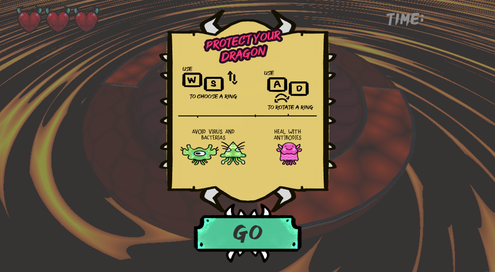

# 🐉 Protect Your Dragon

**Protect Your Dragon** es un videojuego de defensa arcade creado en Unity durante una Game Jam en un tiempo estimado de 48-72 horas.

🎮 **Juega ahora en Itch.io:** [https://spielwiss.itch.io/protect-your-dragon](https://spielwiss.itch.io/protect-your-dragon)

## 🧠 Descripción

En este juego, eres el sistema digestivo de un dragón. Tu misión es protegerlo de bacterias invasoras que amenazan con debilitarlo desde dentro. Gira anillos concéntricos para dejar pasar comida nutritiva y bloquear las bacterias antes de que lleguen al núcleo.

### Características principales

- 🎯 Mecánica única de defensa girando anillos internos.
- ⚔️ Dilema constante entre dejar pasar comida o bloquear enemigos.
- 🧪 Estética orgánica, caricaturesca y grotesca.
- ⏱️ Enfoque de superación personal: sobrevive el mayor tiempo posible.

## 🕹️ Controles

- **WASD**: Rotar los anillos digestivos.
- **Mouse**: Interfaz y selección en menú.

## 🧩 Mecánicas

- **Rotación 360° de anillos:** Alinea secciones seguras para dejar pasar alimentos o zonas de daño para eliminar bacterias.
- **Oleadas dinámicas:** Bacterias y comida aparecen aleatoriamente, creando desafíos constantes.
- **Vida del dragón:** Permite el paso de comida para regenerarla y bloquea bacterias para evitar perderla.

## 📦 Requisitos

- **Motor:** Unity
- **Plataforma de publicación:** Web (Itch.io)
- **Controles:** Teclado

## 🖼️ Estilo visual y sonoro

- **Arte:** Estética cartoon con un toque grotesco suave. Colores internos viscerales con contrastes brillantes en alimentos y enemigos.
- **Audio:** Marimbas, xilófonos y sonidos viscosos para reforzar el ambiente digestivo fantástico.

## 👥 Créditos

- Juanita Garcia: **Developer, Music**
- Christian Garzon: **Developer, Project Manager**
- Cindy Monroy: **2D Artist, Animation, UI**
- Gustavo Leon: **3D Artist, Technical Artist**

## 📷 Capturas

## ✅ Estado

Proyecto finalizado para la Game Jam. Disponible en versión web.

---

¡Gracias por jugar y proteger a tu dragón!
