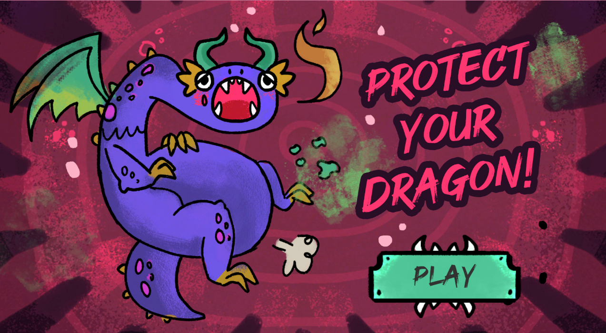

# 🐉 Protect Your Dragon

**Protect Your Dragon** is an arcade defense video game created in Unity during a Game Jam in an estimated time of 48-72 hours.

🎮 **Play now on Itch.io:** [https://spielwiss.itch.io/protect-your-dragon](https://spielwiss.itch.io/protect-your-dragon)

## 🧠 Description

In this game, you are the digestive system of a dragon. Your mission is to protect it from invading bacteria that threaten to weaken it from the inside. Rotate concentric rings to let nutritious allies pass through and block bacteria before they reach the core.

### Main features

- 🎯 Unique defense mechanics by rotating internal rings.
- ⚔️ Constant dilemma between letting allies pass or blocking enemies.
- 🧪 Organic, cartoonish and grotesque aesthetics.
- ⏱️ Self-improvement approach: survive as long as possible.

## 🕹️ Controls

- **WASD**: Rotate the digestive rings.
- **Mouse**: Interface and menu selection.

## 🧩 Mechanics

- **360° ring rotation:** Aligns safe sections to let food pass through or damage zones to eliminate bacteria.
- **Dynamic Surges:** Bacteria and Allies appear randomly, creating constant challenges.
- **Dragon Life:** Allows allies to pass through to regenerate it and blocks bacteria to avoid losing it.

## 📦 Requirements

- **Engine:** Unity
- **Platform:** Web (Itch.io)
- **Controls:** TKeyboard

## 🖼️ Visual and sound style

- **Art:** Cartoon aesthetics with a soft grotesque touch. Visceral internal colors with bright contrasts in food and enemies.
- **Audio:** Marimbas, xylophones and slimy sounds to reinforce the fantastic digestive environment.

## 👥 Credits

- Juanita Garcia: **Developer, Music**
- Christian Garzon: **Developer, Project Manager**
- Cindy Monroy: **2D Artist, Animation, UI**
- Gustavo Leon: **3D Artist, Technical Artist**

## 📷 Screenshots
### 👥 Team

### 🧭 Main Menu

### 🎮 Controls

### 🐉 Gameplay

### ☠️ Gameover screen

## ✅ Status

Finished project for the Game Jam. Available in web version.

---

Thank you for playing and protecting your dragon!
